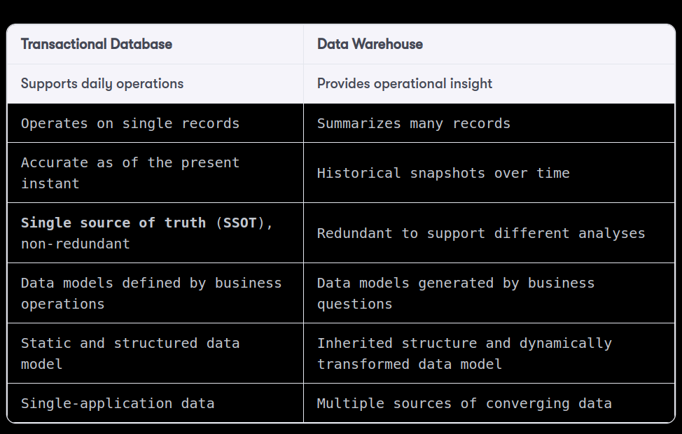
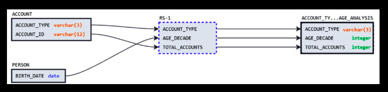

### OLAP vs OLTP



### Lineage Diagram
```snowflake
CREATE TABLE account_types_age_analysis AS
SELECT a.account_type,
       ROUND(DATEDIFF(years, p.birth_date, CURRENT_DATE()), -1
       )                   AS age_decade,
       COUNT(a.account_id) AS total_accounts
FROM account AS a
         INNER JOIN person AS p
                    ON a.person_id = p.person_id
GROUP BY 1, 2;
```



