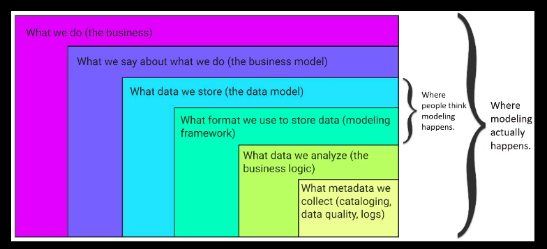
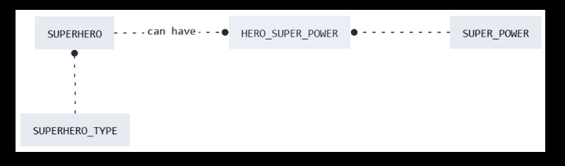
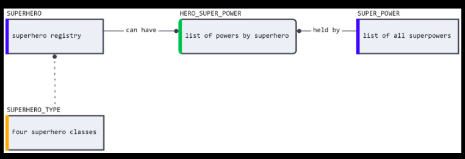
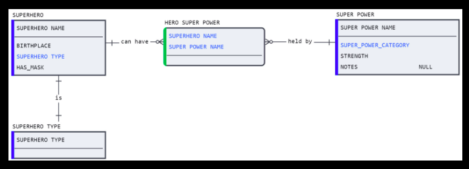

# Chapter 2: An Introduction to the Four Modeling Types

### Hot-takes
- "What is needed is a business-readable language that developers use to build and document the database landscape."
- "Break industry standards: Be flexible and eschew dogmatism in favor of usability"

## Ubiquitous modeling



A set of modelling principles to adhere to:

```bash
- KEEP IT SIMPLE STUPID [KISS]: Simplest approach is often the best (or at least tends towards the best)
- BE CONCISE
- BE UNAMBIGUOUS: 1 convention means 1 thing
- EMBRACE INDUSTRY STANDARDS: When they facilitate understanding
- BREAK INDUSTRY STANDARDS: usabibility over dogmatism all day
```

## Type 1: Conceptual Modelling

conceptual modelling is the process of identifying and visually mapping moving pieces or entities of a business operation.

### An Example Modelling Statements

**defining the entity(ies)**
- `Superman` is an instance within the `SUPERHERO` entity

**defining the entity attributes**
- The `Superhero` entity has a `Birthplace` attribute with the value `Krypton` for the `Superman` instance
- `SUPERHERO` has a `SUPER_POWER`

**entity granularity**
- The `SUPERHERO` entity is maintained at the grain of an individual hero. A single row in `SUPERHERO` represents one unique hero and their attributes.
- The `SUPERHERO_POWER` entity is maintained at the grain of the hero superpowers. A single row in `SUPERHERO_POWER` represents just one of the many powers that a superhero can have

**relationship granularity: cardinality**
- A `SUPERHERO` has one `SUPERHERO_TYPE`
- A `SUPERHERO` can have more than one `SUPERHERO_POWER`

**relationship granularity: optionality**
- A `SUPERHERO` must have one and only one `SUPERHERO_TYPE`
- A `SUPERHERO` can have zero or one or more `SUPERHERO_POWER`

**Conceptual Model 01 ER simple**



**Conceptual Model 02 ER with descriptions**



**Conceptual Model 03 ER_with_attributes_and_cardinality**



## Type 2: Logical Modelling


## Type 3: Physical Modelling


## Type 4: Transformational Modelling


