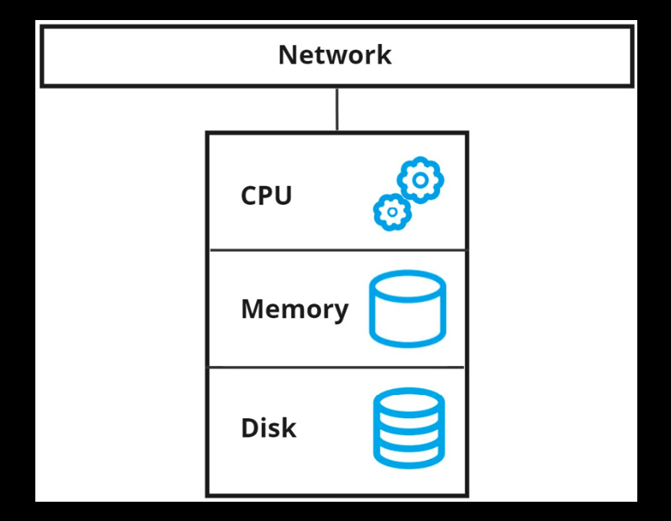
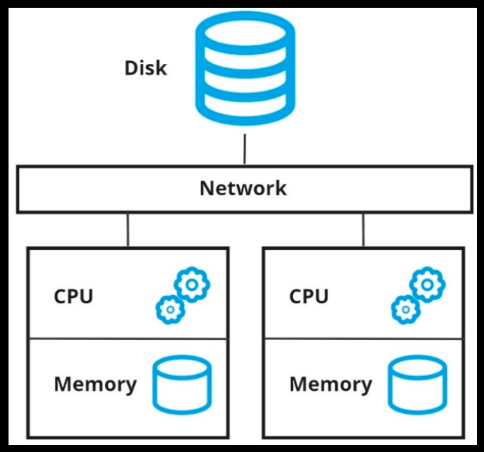
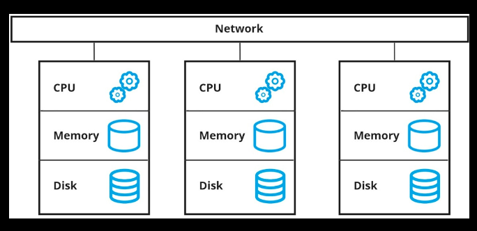

# Chapter 3: Mastering Snowflake’s Architecture

## Traditional architectures

**A diagram of a typical on-premises database server**

- **Capital Expenditure**: Before the advent of cloud architecture and Software as a Service (SaaS) models, hardware purchases for on-premises servers required significant capital expenditure (CapEx).
- **Hardware Sizing**: Estimating current and future computing needs, known as hardware sizing, necessitates careful planning. Conservative estimates could lead to earlier-than-expected upgrades, while overshooting could result in underutilization of expensive, cutting-edge technology.
- **Growth and Usage Spikes**: Data volume and CPU demands typically grow in sync with the business. However, unpredictable spikes in storage or compute usage are common and can cause challenges.

**A diagram of a shared-disk architecture**

- **Central Storage**: Shared-disk architecture uses a central storage location that is accessible to various compute clusters in a network.
- **Concurrency Issues**: This architecture suffers from physical implementation issues when locking and accessing the data concurrently.
- **Scalability with Compute Clusters**: The shared-disk design allows for the addition of compute clusters of varying sizes to accommodate different workloads. However, this leads to a bottleneck.
- **Bottleneck Issues**: The more clusters added to the network, the worse the contention for the central disk becomes, creating a bottleneck.
- **Limited Scalability**: Despite its design, shared-disk architecture fails to deliver on the promise of scalability due to these bottlenecks on the most important resource of a database: the data.

**A diagram of a shared-nothing architecture**

- **Isolated Storage**: Shared-nothing architectures, like those used by AWS Redshift and Greenplum, avoid the issues of shared-disk by isolating storage and making it part of the compute cluster.
- **Demand-based Sizing**: This design allows database clusters to be sized based on demand, addressing the varying consumption needs of teams across an organization.
- **Data Transfer**: Nodes in a shared-nothing architecture require data transfer to share information, which can impact performance.
- **Balancing Storage and Processing**: Tying the disk to the overall cluster means striking a balance between storage and processing patterns, which can vary independently.
- **Limited Tuning and Maintenance**: Shared-nothing platforms did not offer many options for tuning each resource individually, and they were not simple to maintain and administer.
- **Paving the Way**: Despite its limitations, shared-nothing architecture paved the way for platforms like Snowflake to tackle cloud computing challenges with cloud-native designs.

