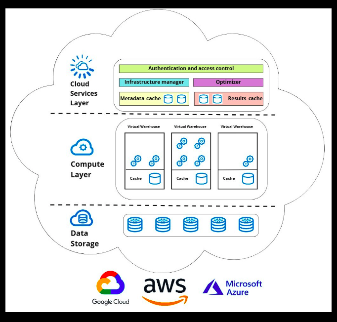

# Chapter 3: Mastering Snowflake’s Architecture

## Traditional architectures

**A diagram of a typical on-premises database server**

- **Capital Expenditure**: Before the advent of cloud architecture and Software as a Service (SaaS) models, hardware purchases for on-premises servers required significant capital expenditure (CapEx).
- **Hardware Sizing**: Estimating current and future computing needs, known as hardware sizing, necessitates careful planning. Conservative estimates could lead to earlier-than-expected upgrades, while overshooting could result in underutilization of expensive, cutting-edge technology.
- **Growth and Usage Spikes**: Data volume and CPU demands typically grow in sync with the business. However, unpredictable spikes in storage or compute usage are common and can cause challenges.

**A diagram of a shared-disk architecture**

- **Central Storage**: Shared-disk architecture uses a central storage location that is accessible to various compute clusters in a network.
- **Concurrency Issues**: This architecture suffers from physical implementation issues when locking and accessing the data concurrently.
- **Scalability with Compute Clusters**: The shared-disk design allows for the addition of compute clusters of varying sizes to accommodate different workloads. However, this leads to a bottleneck.
- **Bottleneck Issues**: The more clusters added to the network, the worse the contention for the central disk becomes, creating a bottleneck.
- **Limited Scalability**: Despite its design, shared-disk architecture fails to deliver on the promise of scalability due to these bottlenecks on the most important resource of a database: the data.

**A diagram of a shared-nothing architecture**

- **Isolated Storage**: Shared-nothing architectures, like those used by AWS Redshift and Greenplum, avoid the issues of shared-disk by isolating storage and making it part of the compute cluster.
- **Demand-based Sizing**: This design allows database clusters to be sized based on demand, addressing the varying consumption needs of teams across an organization.
- **Data Transfer**: Nodes in a shared-nothing architecture require data transfer to share information, which can impact performance.
- **Balancing Storage and Processing**: Tying the disk to the overall cluster means striking a balance between storage and processing patterns, which can vary independently.
- **Limited Tuning and Maintenance**: Shared-nothing platforms did not offer many options for tuning each resource individually, and they were not simple to maintain and administer.
- **Paving the Way**: Despite its limitations, shared-nothing architecture paved the way for platforms like Snowflake to tackle cloud computing challenges with cloud-native designs.

## Snowflake’s architecture

The major points regarding Snowflake's architecture from the provided text are:

- **Cloud-Native Design**: Snowflake is a modern platform built natively for the cloud, leveraging its unique features to enable concurrency, scalability, and real-time collaboration.

- **Integrated Storage**: Snowflake still relies on physical disks but integrates them logically to provide centralized storage to its computing clusters without concurrency bottlenecks or data replication overhead.

- **Separation of Data and Compute**: Snowflake separates the data from compute workloads, which can be independently provisioned and resized.

- **Three-Layer Architecture**: Snowflake operates on a three-layer architecture consisting of storage, compute, and cloud services, all of which are managed by Snowflake.

- **Storage Layer**: The storage layer physically stores data on disks in the cloud provider hosting the Snowflake account. As data is loaded into Snowflake, it is compressed, encrypted, and logically organized into tables, schemas, and databases.

- **Compute Layer**: The compute layer, also known as the processing or virtual warehouse layer, provides a cluster of virtually provisioned CPU and temporary memory resources for executing queries.

- **Services Layer**: Snowflake’s services layer coordinates all account activity in this hybrid-layer model and manages everything from security to encryption to metadata.

- **Scalability**: Snowflake's architecture allows for simple and consistent utilization of resources, with the ability to scale up (doubling the number of servers in the cluster) or scale out (adding warehouses of the same size to a compute cluster for increased concurrency).

- **Ease of Use**: Snowflake promises the user near-zero maintenance along with low cost and exceptional performance.

## Snowflake’s features

Snowflake offers several innovative features that enhance its performance and usability:

1. **Zero-Copy Cloning**: This feature allows users to clone data without physically duplicating it, saving on storage costs and time. Cloning is ideal for creating system backups and testing environments.

2. **Time Travel**: Time Travel allows users to query or clone data from a previous point in time, enabling recovery from mistakes or comparison of changes from the present state. However, it does use extra storage and incurs associated costs.

3. **Hybrid Unistore Tables**: Announced at Snowflake Summit 2022, Hybrid Unistore tables combine an analytical and a transactional table to provide a unified solution that offers the best of both OLAP and OLTP databases.

4. **Beyond Structured Data**: Snowflake excels at working with relational tables and semi-structured data, and even supports unstructured files through external tables. Users can work with various file formats in a way that is as familiar and performant as querying a table.

## Costs to Consider

Snowflake employs a consumption-based model known as variable spend, which includes the following costs:

1. **Storage Costs**: Customers are billed based on the daily average of the data stored in the platform. This includes raw data as well as Time Travel and fail-safe backups.

2. **Compute Costs**: Consumption is billed based on the number of virtual warehouses used, how long they run, and their size. Warehouses consume credits for as long as they are active, regardless of whether they are running queries.

3. **Service Costs**: The services layer manages essential operations and performs automated serverless tasks. The cost of the services layer is included in the warehouse credits as long as it does not exceed 10% of the daily warehouse consumption.

Understanding these costs can help users manage their usage patterns and control their costs effectively.
