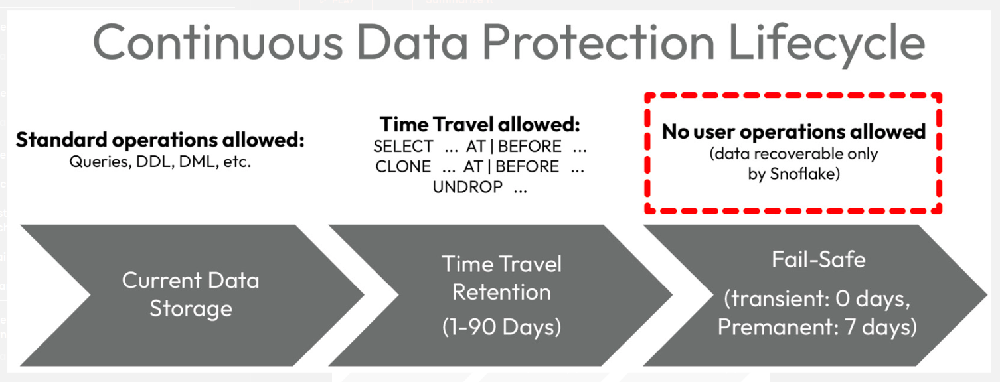

# Chapter 4: Mastering Snowflake Objects

**Topics covered in this chapter:**

- `stage` and `file_format` objects used for loading data into Snowflake
- The various physical `table` types used to store data
- `metadata_table` for reviewing staged files
- `view` and associated cost and performance benefits
- `materialized_view` and when to use them
- `stream` for data change tracking
- `task` for automating continuous ETL pipelines

## Stages [`stage`]


- **Stages** are logical objects in Snowflake that abstract cloud filesystems for data loading.
 
- There are two types of stages: **external** and **internal**.
 
- **External stages** are created on top of a cloud location outside Snowflake and are used to load data from external source systems.
 
- **Internal stages** are created within the Snowflake account and are used to stage files that originate from within the Snowflake account.
 
- Supported cloud storage services for external stages include **Amazon S3 buckets**, **Google Cloud Storage buckets**, and **Microsoft Azure containers**.
 
- Stages can store any type of file, but only certain structured and semi-structured file types are supported for loading data into Snowflake.

- A file format must be specified when accessing data from a stage for subsequent loading into a Snowflake table.

## File Formats [`file_format`]

- A file format defines properties such as the **delimiter type**, **date/time formats**, and **encoding**.
- Snowflake supports several structured and semi-structured file formats, such as **CSV**, **JSON**, and **Parquet**.
- Users can create their own named file formats when loading or unloading files of a specified type.
- File format properties can also be specified at runtime when using the **COPY INTO** command.
- references:
  - [Preparing to Load Data](https://docs.snowflake.com/en/user-guide/data-load-prepare)
  - [Load Data into Snowflake](https://docs.snowflake.com/guides-overview-loading-data)

## Tables [`table`]
**Data Protection Lifecycle in Snowflake**



Here is a list of tables and how they are used in Snowflake:
### Physical Table

- `CREATE TABLE AS SELECT`:
  - Commonly referred to as CTAS, creates a table containing the data returned from a query (and using the implied data types).
- `CREATE TABLE USING TEMPLATE`:
  - Creates an empty table using column definitions derived from semi-structured files (currently supported for Parquet, Avro, and ORC formats).
- `CREATE TABLE LIKE`:
  - Creates an empty table using the column definitions of an existing table. Column properties, defaults, and constraints are also copied.
- `CREATE TABLE CLONE`:
  - Does the same as LIKE but uses zero-copy cloning to also include all the data from the source table (without actually copying it). The CLONE variant can be used with Time Travel to clone the data at a specific point in the past. Cloned tables do not consume storage until the structure or contents are modified in the clone or source objects.

1. Permanent Table
    ```snowflake
    CREATE TABLE <table_name>
    ```
1. Transient Table
    ```snowflake
    CREATE TRANSIENT TABLE <table_name>
    ```
1. Temporary Table
    ```snowflake
    CREATE TEMPORARY TABLE <table_name>
    ```
1. Hybrid Unistore Table
    ```snowflake
    CREATE HYBRID TABLE <table_name>
    ```
   
**Retention periods for physical tables**


### Stage metadata tables


## Views [`view`]


## Materialized Views [`materialized_view`]


## Streams [`stream`]


## Change tracking [`task`]


## Tasks [`task`]
