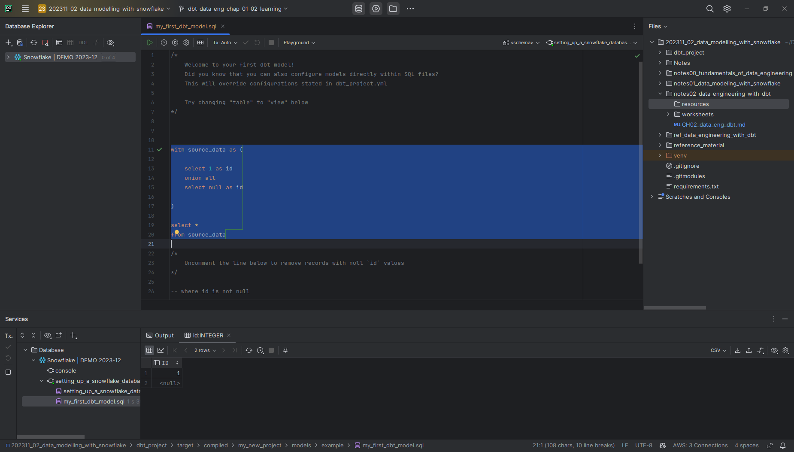
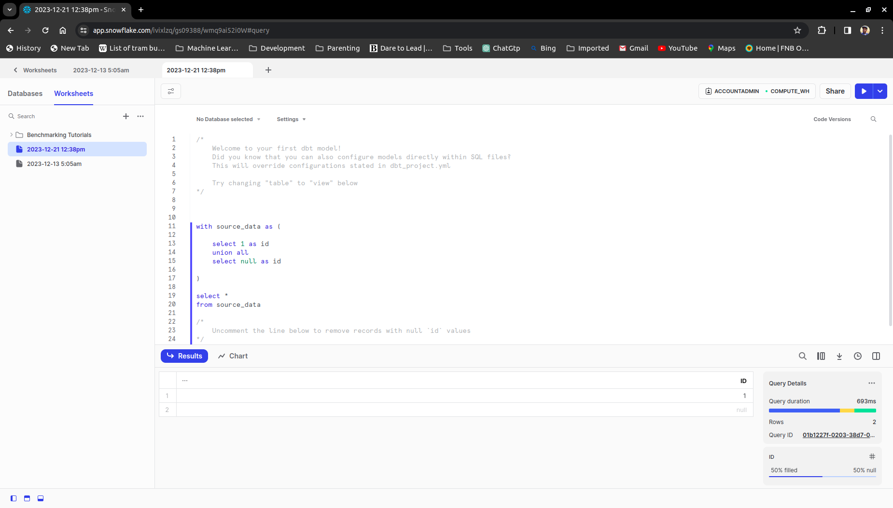
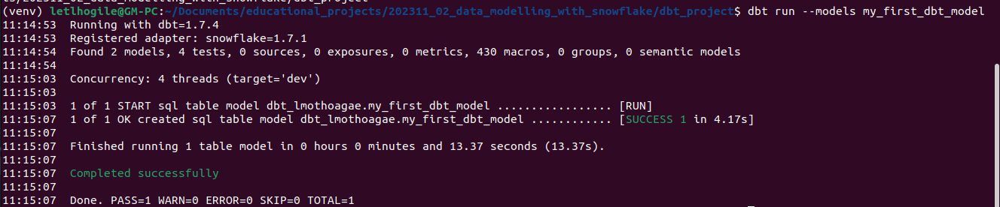
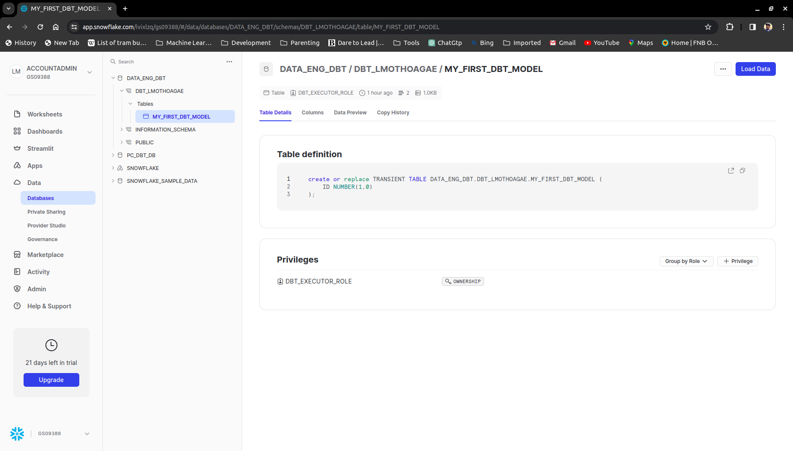
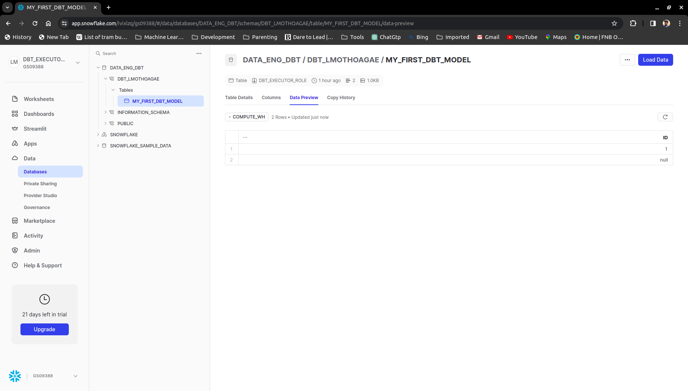
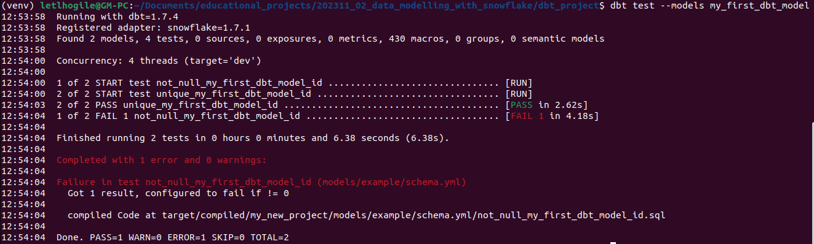
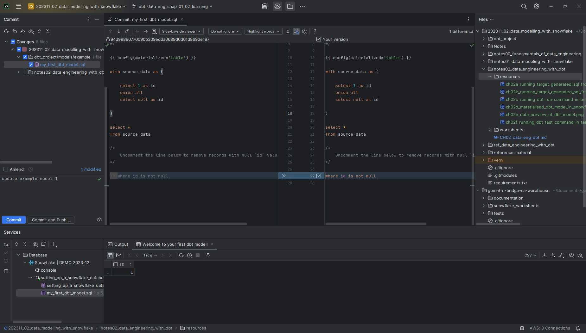
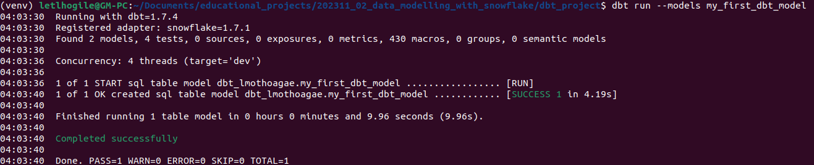
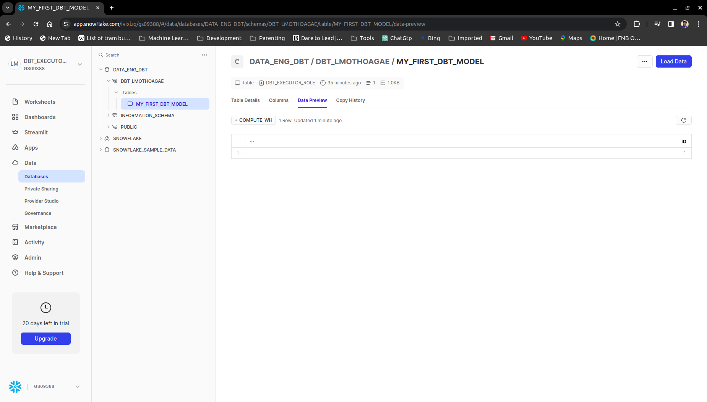
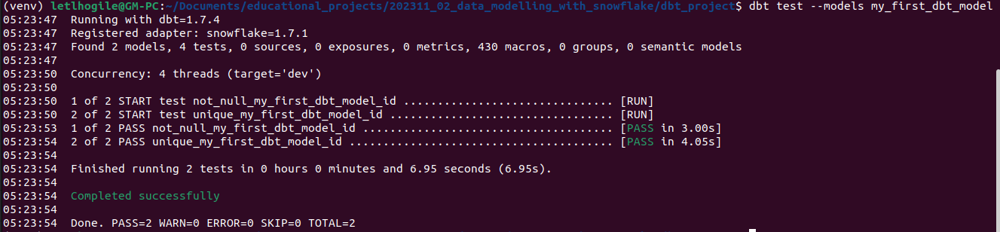

# Chapter 2: Setting up dbt development environment

## dbt Core workflows

### A typical workflow to develop a feature with dbt Core can look like the following:

1. Before starting a new feature, if you use a VCS and follow the best practices to do new work in development branches, go to the command line and run the commands for your VCS to create a new branch and set it as the active branch in the project folder.
   1. create a virtual environment for the repo and activate it. in the example below we use venv
      ```
      python3 -m venv venv
      source venv/bin/activate
      ``` 
   1. install dbt for snowflake
      ```
      pip install dbt-snowflake
      ``` 
   1. create a new folder `.dbt` in the home directory of the user
      ```
      mkdir ~/.dbt
      ``` 
   1. create a new branch in the repo and check it out
      ```
      git checkout -b my_new_feature
      ```
1. You can then create or edit the dbt model in your editor of choice, saving it inside the dbt project folder structure.
   1. create a new directory in the repo for the dbt project modelling
      ```
      mkdir dbt_modelling
      ```
    1. change directory to the new directory
        ```
        cd dbt_modelling
        ```
    1. initialize the dbt project
        ```
        dbt init
        ```
1. To see whether the current version works, without applying the changes to your DB, you have to go to the command line and run the following command, with `eventual switches` to just compile what you have changed:
    ```
    dbt compile <eventual switches>
    ```
   example:
   ```
    dbt compile --models my_first_dbt_model
    ```
   
   This generates or updates the compiled SQL file for each model under the target folder.

   
   
**an example of running the target generated SQL from the IDE**

   
   
**an example of running the target generated SQL from the Snowflake worksheet**


4. If all works and you get no compilation errors, you’ll find the compiled SQL file for the model under the target folder. Once you find the file you have to open it, copy its contents, and paste them into a place where you can run them on your DB. In the case of Snowflake, you can copy them into a Snowflake worksheet and run them from there. Some code editors also allow running SQL scripts.


   As an alternative, you can replace the cumbersome steps 3 and 4 and do like in step 7, running the model you want to test using the dbt run command, but once you run it, you will change your DB and won’t be able to easily go back to the previous version without reverting the code and running the old version again. Note that going back and rerunning does not work for incremental models.
 
5. You’ll see the result of your model; if you need to make changes, go back to step 1, repeating the process of editing, compiling, opening, copying, pasting, and executing until you are happy.

1. When you are satisfied and want to apply the changes to your DB, go to the command line and run the following command, with `eventual switches` to run the models related to the current development:
   ```
   dbt run <eventual switches>
   ```
   examples:
   1. switch as name of model
      ```
      dbt run --models my_first_dbt_model
      ```

   1. switch as multiple models
      ```
      dbt run --models my_first_dbt_model my_second_dbt_model my_third_dbt_model
      ```


   
   
   **an example of running the dbt run command in the terminal**

   
   
   **an example of materialised dbt model in Snowflake**

   
   
   **an example of data preview of dbt model**
   

   This generates or updates the compiled SQL file for each model under the target folder and then runs it on the DB enclosing the SELECT query in the code to generate the view or table.
   
   **NB!** ensure that model names are unique across the project and self-explanatory for ease of use. 

7. Then, execute the tests that you have declared or written by issuing the following command, with `eventual switches` to test the models related to the current development:
   ```
   dbt test <eventual switches>
   ```
    examples:
    1. switch as name of model
        ```
        dbt test --models my_first_dbt_model
        ```
       

1. When you are happy with the development and have completed a set of changes that you want to save to your VCS, go back to the command line and issue the appropriate commands to commit the changes. You need to know the relevant commands.


   
**changes in the IDE**


   
**running updated dbt run command**


   
**updated data preview of model in Snowflake**


   
**updated data preview of model in Snowflake**


   
**running updated dbt test command**

9. When you are ready to finish the development and ask your colleagues for feedback, before merging your code into the main development branch, go to your VCS and start a new pull request. When the pull request is approved, merge it and you are done.

### A typical workflow to run a dbt project looks like the following

1. Put the code that you want to run in the dbt project folder. This is usually done by checking out the desired branch, but any way you choose works for the dbt product.

1. Run from the command line, maybe using a shell script, a sequence of dbt commands that performs the operations that you want. A typical case is as follows:

   1. Optionally, run any `dbt run-operation` command needed to maintain the DB, set up access to the data sources, or import data into landing tables. 

   1. Check the data source freshness with the `dbt source freshness` command. 

   1. Run the tests on the source data or landing tables you are going to read from. 

   1. Run the eventual `dbt snapshot` command to store the changes in the sources, followed by eventual tests on the snapshots. 

   1. Run the dbt models; that is, issue the `dbt run` command.

   1. Then, run the tests on the models with the `dbt test` command.

   1. Generate the documentation with the `dbt docs generate` command.


   This is a simple setup that can get you quite far in real-world usage.
   
3. Monitor the logging info that is output during the execution to verify that all went well, and at the end of every step, you can decide whether to proceed to the next step until you are done.
   
    Note that if you use a script to run the commands, you should have checks on the output, as you should stop the run if an error occurs at some point.

1. If you do not need to store the logging info, you are done; otherwise, you need to set up something that captures the logging info and stores it as you need.

1. If you want to schedule the run, you need to set up the scheduling yourself, with whatever technology you have at your disposal. In simple setups, this is often achieved using a scheduler such as `cron`.

1. If you want to store or publish the results of the data source freshness check, you need to capture the result or extract it from the JSON files generated by the execution and publish it.

1. If you want to publish the generated documentation, you need to copy the generated files, which are generated ready to be published, in a place from where to publish them. A simple choice is to copy them to a file bucket in Amazon S3 or a similar service that is then published to your desired audience.